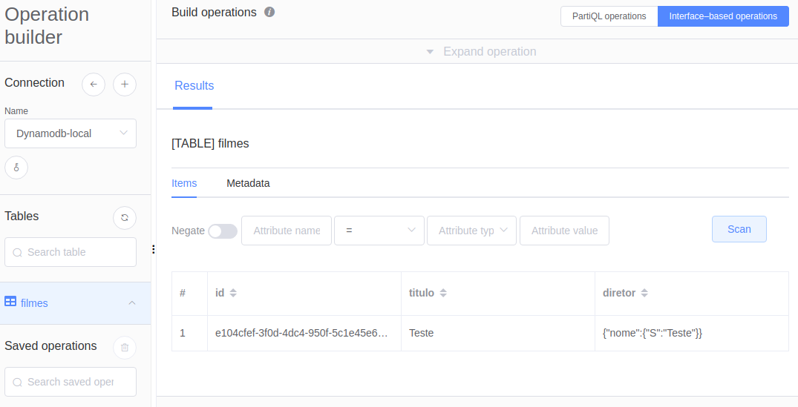

# Poc - Springboot + Aws Services

### Iniciando o local-stack com Dynamodb, Sqs:
Na pasta `resources` há um arquivo de docker compose que deve ser executado:
```bash
docker-compose up localstack
```

### Ferramentas:

- [NoSQL Workbench]: importar o arquivo: `\resourcers\Db_filmes_poc.json`

### Exemplo de inclusão de registro: 
```json
//rota: (POST) http://localhost:8081/filme
//Body        
{
  "titulo": "Teste",
  "nome_diretor": "Teste"
}
```



<!-- Links -->
[NoSQL Workbench]: <https://docs.aws.amazon.com/amazondynamodb/latest/developerguide/workbench.settingup.html>